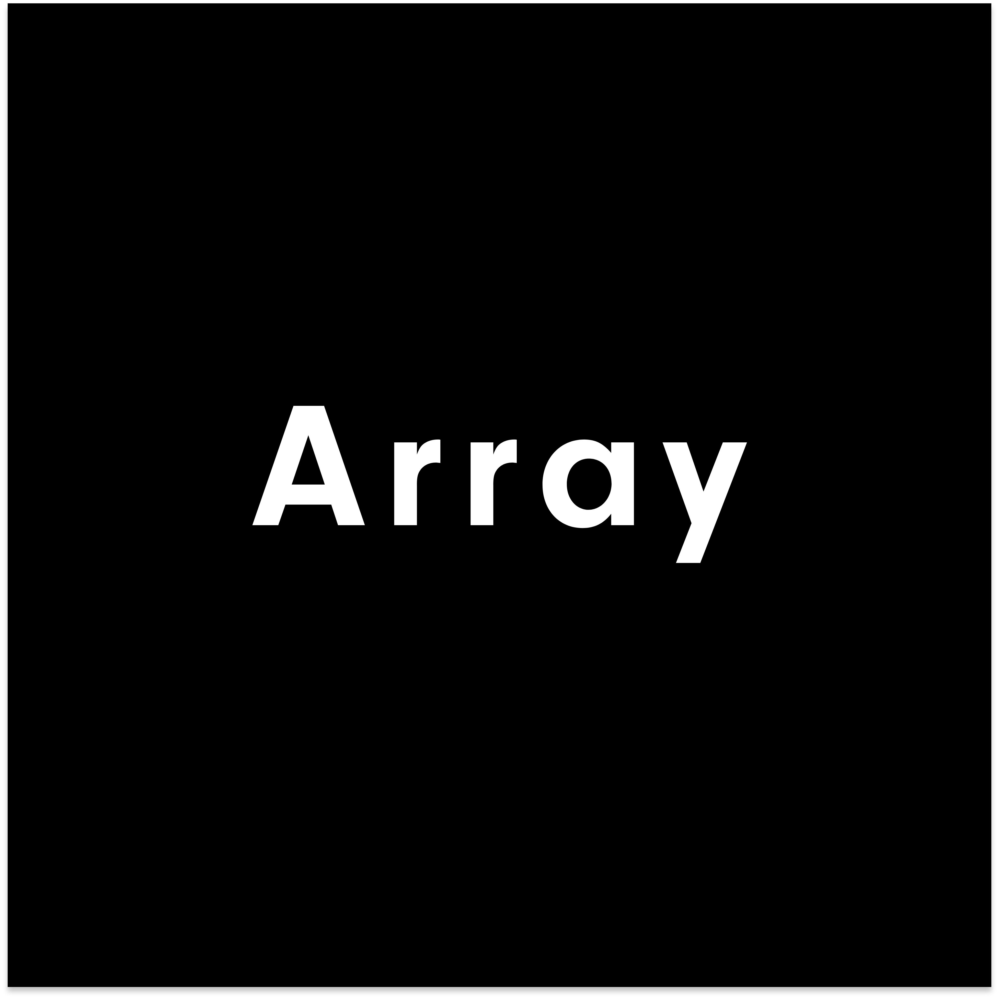
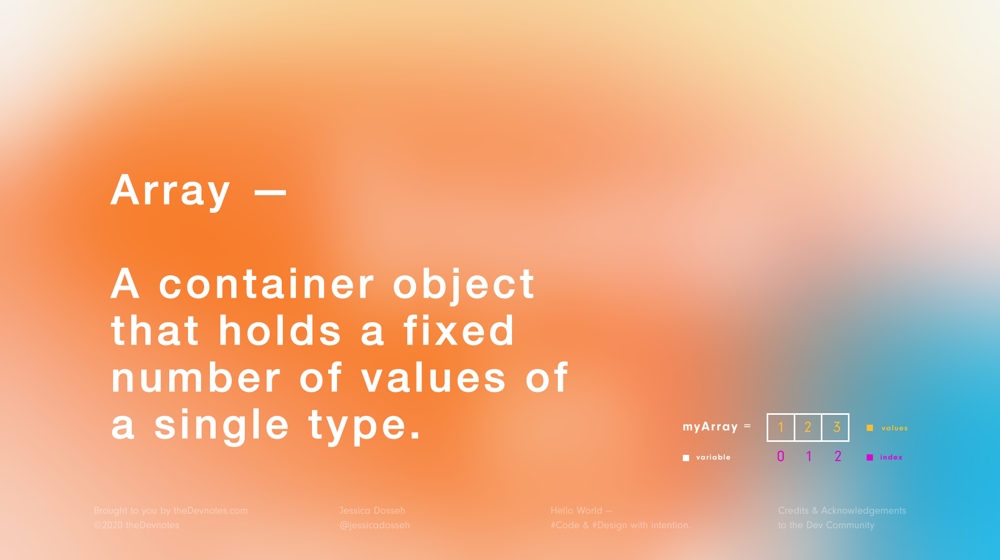

<div align="center">
  
  
  <hr height="0.5px" />
  
  <br/>
  <p> Data Structures </p>
  <h3> Arrays </h3>
  <p> A container object that holds a fixed number of values of a single type. </p>
  <p> Arrays are one of the most classic and most commonly used data structures.</p>
  <br/>
</div>

<hr/>

<div align="center">
  
</div>

<br/>

### Structure

---

```text
variable declaration — (array name)

size of the array — (declared depending on the language)

elements within the array — (determine the type of the array)

index of the array — (starts with 0 to len(array) - 1)
```

<br/>
<br/>

### Implementation

---

```py
integerArray = [1, 2, 3, 4, 5] # DataType: integer | Index: 0 - 4 | Length: 5

stringArray = ['Jane', 'Dan', 'Sam'] # DataType: string | Index: 0 - 2 | Length: 3

booleanArray = [True, False] # DataType: boolean | Index: 0 - 1 | Length: 2

characterArray = ['c', 'o', 'd', 'e'] # DataType: character | Index: 0 - 3 | Length: 4

```

<br/>
<br/>

### Operations

---

<br/>
<br/>

> `init` — initialize / create the array

```py
myArray = [1, 2, 3, 4, 5]
```

<br/>
<br/>

> `get` — access value in the array. This will return the value at the index location

```py
myArray[index]
```

<br/>
<br/>

> `set` — update value in the array at the given index

```py
myArray[index] = new_value
```

<br/>
<br/>

> `traverse` — go through each element in the array

```py
for index in range(len(myArray)):
  print(myArray[index])
```

<br/>
<br/>

> `copy` — make a duplicate of the array

```py
newArray = myArray
```

<br/>
<br/>

> `insert` — add an element to the array

```py
# add element to the end
myArray.append(6)

# add element to a specific index / location in the array
myArray.insert(index, value)

# appending an array to a different array
someArray = [5, 9, 3]
myArray.extend(someArray)
```

<br/>
<br/>

> `delete` — remove an element in the array

```py
# remove a specific value in the array
myArray.remove[value]

# remove an element at a specified index
myArray.pop(index) # pop() also returns the value popped

del myArray[index]
```

<br/>
<br/>

### Applications

---

```py

# Static Array - when you have to specify the length of the array when you declare it


array = [6, 1, 4]
```

```py
# Dynamic Array (aka vector) - Is an array that can change in size by allocating extra space in memory.


array = [6, 1, 4, __, __, __]
```

```py
# Arrays are used to implement other data structures, such as lists, heaps, hash tables, deques, queues and stacks.
```

```py
# All sorting algorithms use arrays at their core.
```

<br/>
<br/>

### Credits, Acknowledgments, & Resources

---

by the Dev Community
